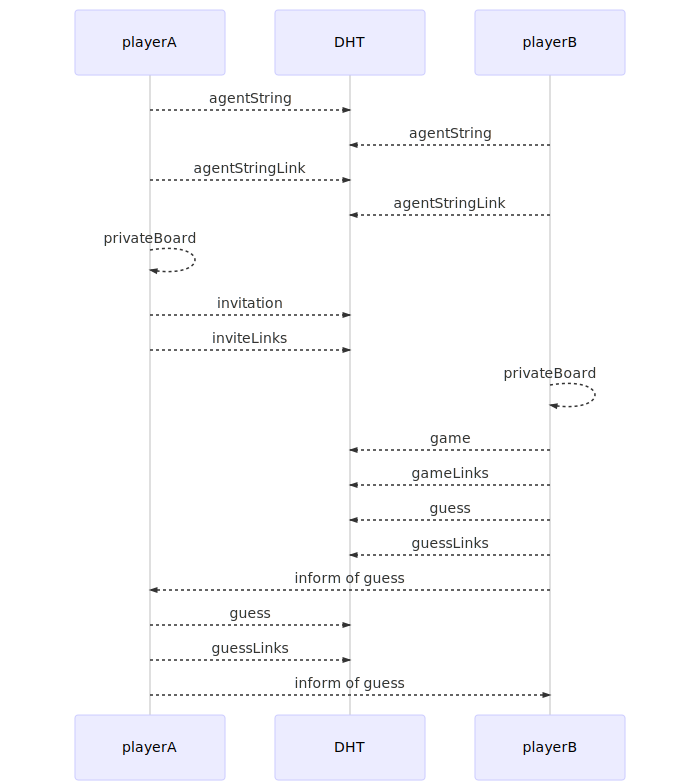

# Holochain-Battleship

The classic two player game battleship implemented in Holochain

While much of the functionality is working this is still under active development. No validation or UI at this stage.

## Overview

This is an educational example of peer-to-peer interactions usign Holochain. Battleship makes a great example as it requires some interesting mechanics including:

- Making use of the local chain to commit a board layout while keeping it secret
- Sending and responding to guesses using messaging 
- Validation of game rules to prevent cheating
- Keeping a validated record of all game actions in the shared DHT

## Design

If an agent (PlayerA) wishes to play a game with another agent (PlayerB) they first need create a board which defines where they want their ships located in the 10x10 grid which committed to their local chain. The board entry also has some salt stored with it so the layout cannot be inferred from the hash.

They then post an **invitation entry** to the DHT. The invitation contains the address of the agent with wish to play with as well as the hash of the board entry. This public sharing of the board hash prevents the agent from changing it later. This invitation is linked to the other agents permanent address.

PlayerB can check their pending invitations by querying the links on their address. To take action an invitation PlayerB must also commit a board to their local chain and then posts a **game entry**. The game entry contains the addresses of both players along with their board hashes. PlayerB gets to make the first guess.

A **guess entry** represents the equivalent of a player taking their turn to guess out loud a particular location (e.g. D5). Guess entries are linked to their game. After posting their guess public the player then uses the messaging protocol to inform the other agent. Upon checking that the guess is committed to the DHT the other player will respond if that location is a hit or miss. Their response is also stored in the public DHT.

Players take turns guessing and validation ensures that the correct ordering is followed. There will reach a point where one player will guess the final remaining ship location of the other player. This will trigger the end of the game. On this trigger both agents will publish the previously private boards to the public DHT. The winning player will then publish a **results entry**. Pushing this entry to the DHT triggers a validation process which ensures every guess and response was in accordance with the respective boards. Passing validation the results entry is published and linked to both players address.

The revealing of the board at the end of the game allows any party to audit a game and ensure that guesses and responses made during the game were correct.

Sequence diagram of test scenario 1. In order the players:
- Both register their names
- Player A commits a private board and sends an invite
- Player B commits a private board and accepts the invite
- Player B makes a guess to which player A responds
- Player A makes a guess to which player B responds




## Getting Started

Assuming you have a working installation of Holochain simply clone the repo run in development mode using:
```
hcdev web 
```
from the project directory. To run the tests or test scenarios use
```
hcdev test
```
or 
```
hcdev --mdns=true scenario testGame1
```

To produce the mermaid sequence diagram code use
```
hcdev --mdns=true scenario testGame1 | sed -n 's:.*<mermaid>\(.*\)</mermaid>.*:\1:p'
```
## Authors

[Willem Olding](https://github.com/willemolding)

## License

This project is licensed under the MIT License - see the [LICENSE.md](LICENSE.md) file for details
